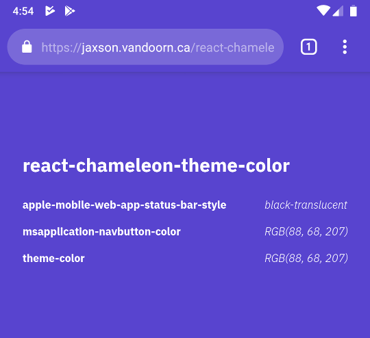

# React Chameleon Theme Color

[](https://github.com/woofers/react-chameleon/actions) [](https://www.npmjs.com/package/react-chameleon-theme-color) [](https://www.npmjs.com/package/react-chameleon-theme-color) [](https://www.npmjs.com/package/react-chameleon-theme-color) [](https://github.com/woofers/react-chameleon-theme-color/blob/master/License.txt)

A simple React component to set the theme color of mobile browsers menu bars.


# Devices

The effect of this component varies by device and by browser.  See demo on a mobile device.

**[Live Demo](https://jaxson.vandoorn.ca/react-chameleon-theme-color/)**




## Android

The [theme-color](https://developers.google.com/web/updates/2014/11/Support-for-theme-color-in-Chrome-39-for-Android) meta attribute is set to the target color.

This should take effect for Chrome and Opera.


## iOS

For iOS the [apple-mobile-web-app-status-bar-style](https://stackoverflow.com/a/40786240/9129020) meta tag is set.

As Safari only allows either a solid grey, black or transparent status bar,
the `contrastRatio` is used as a threshold to determine what value the meta tag should be.

If the contrast ratio of the color against pure white is greater than the set `contrastRatio`,
the value will be set to `black-translucent` which is a transparent status bar with black text.

Otherwise, the status bar will be set to `default`
which is a grey status bar with black text.

Additionally, [apple-mobile-web-app-capable](https://developer.apple.com/library/archive/documentation/AppleApplications/Reference/SafariHTMLRef/Articles/MetaTags.html#//apple_ref/doc/uid/TP40008193-SW3) is also set which hides the address-bar.


## Windows Phone

Sets the `msapplication-navbutton-color` to the target color.


# Installation

**Yarn**

    yarn add react-chameleon-theme-color

**npm**

    npm install react-chameleon-theme-color


# Usage

```jsx
import React from 'react'
import { ThemeColor, ChameleonThemeColor } from 'react-chameleon-theme-color'

const App = () => (
  <div style={{ background: "#123", padding: "200px" }}>
    <ChameleonThemeColor contrastRatio={1.6} />
    {/* or you can set the color manually */}
    <ThemeColor color="#123" contrastRatio={1.6} />
  </div>
)
```

Simply add either the `ThemeColor` or `ChameleonThemeColor` component to the React application using JSX.

The `ChameleonThemeColor` component will set the target color to the first set in-scope CSS color at runtime.

Alternatively the `ThemeColor` component will set the target color to the value of the `color` prop.


## Props


### Contrast-Ratio

The `contrastRatio` property can be set to control the sensitivity required for a custom color to be used on Apple devices.
The higher the value, the more contrast will be provided between the status bar text and background however it will
also be more likely for the status bar color to be set.

**Default:** `1.6`


### Color

The `color` property controls the target color for the status bar.

Only used for the `ThemeColor` component as `ChameleonThemeColor` component sets this automatically.

If set to `false`, no meta attributes will be set, causing each browser to fallback to its respective default.

**Default:** `false`
